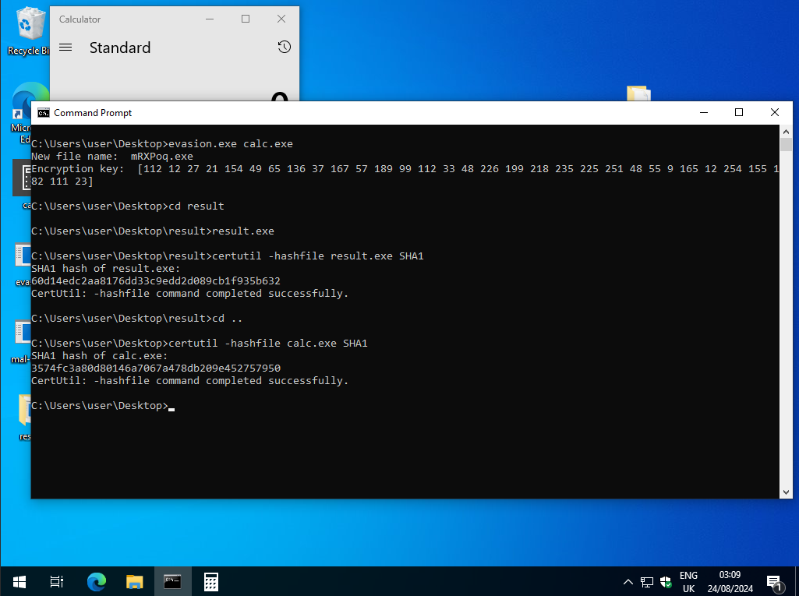
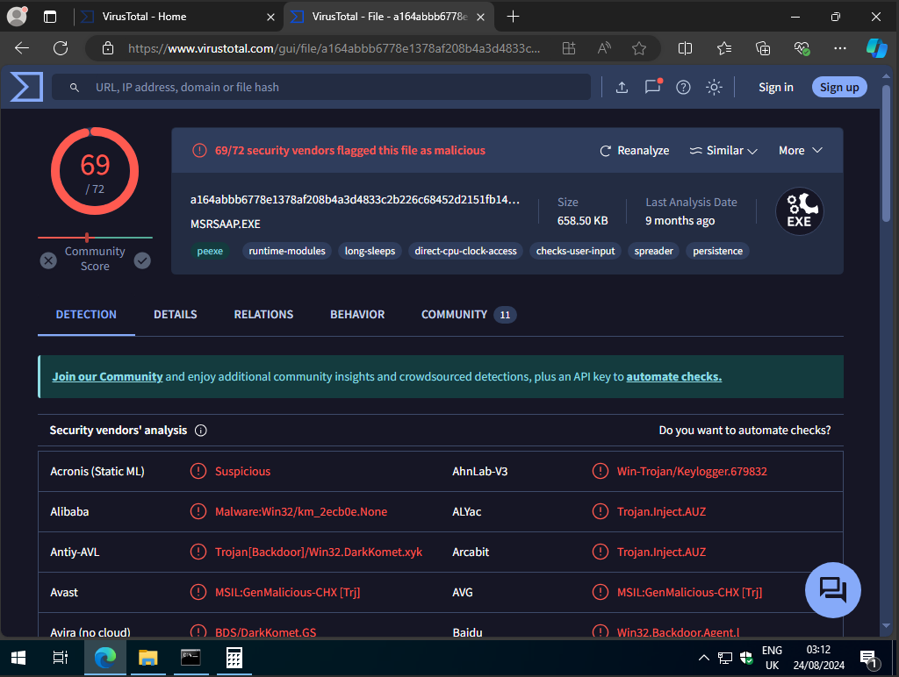
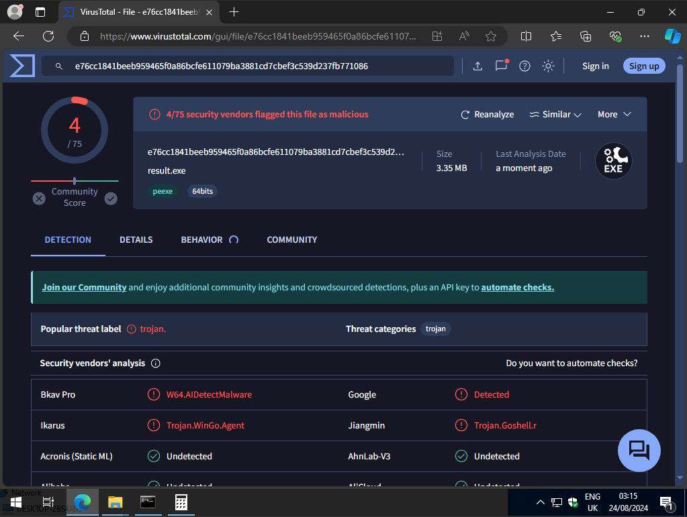

# [evasion](https://github.com/01-edu/public/tree/master/subjects/cybersecurity/evasion)

In this project, we explore techniques for bypassing antivirus software and examine the mechanisms by which antivirus programs detect malware. This project builds upon the foundational concepts covered in the previous ["Mal-Track"](https://github.com/01-edu/public/tree/master/subjects/cybersecurity/mal-track) and ["Injector"](https://github.com/01-edu/public/tree/master/subjects/cybersecurity/injector) projects, offering more advanced insights and methodologies.

## Setup

### 1. **Install VirtualBox:** 

- Download VirtualBox and install it on your host machine.

### 2. **Download Windows 10 ISO:** 

- Obtain the Windows 10 ISO from Microsoft.

### 3. **Create a Virtual Machine:** 

- Set up a new virtual machine using the downloaded Windows 10 ISO.

*Note: You may need to disable the Floppy drive and remove the floppy controller in the VM settings to successfully install Windows.*

### 5. **Enable Host-VM File Communication:** 

- To transfer files between your host and VM, go to the VM window, select Devices -> Insert Guest Additions CD Image, navigate to the CD drive, and run the setup file. Restart the VM afterward. On Virtual box navigate to settings -> Shared Folders -> Add a new shared folder. Select the folder you want to share. This will be visable in the VM under network.

### 6. **Install Go on the VM**

### 7. **Transfer evasion.exe:** 

- Transfer the evasion.exe file from repository to the VM.


## Objective 
### 1. Develop a Windows Program:

- You need to create a program that runs on a Windows operating system.
- The program should perform specific tasks designed to simulate evasion techniques used by hackers.
### 2. Program Features:

**Encrypt Another Program:**

- Your program should be able to encrypt an existing program or binary file. This is to simulate how malware can be hidden from antivirus detection.

#### Example from evasion.go starting at ln 251:
    
```
    func encryptFile(inputData []byte) ([]byte, error) {
	block, err := aes.NewCipher(encryptionKey)
	if err != nil {
		return nil, err
	}

	gcm, err := cipher.NewGCM(block)
	if err != nil {
		return nil, err
	}

	nonce := make([]byte, gcm.NonceSize())
	if _, err := rand.Read(nonce); err != nil {
		return nil, err
	}

	encryptedData := gcm.Seal(nil, nonce, inputData, nil)
	return append(nonce, encryptedData...), nil
}
```

**Increase Size by 101 MB:**

- The program should artificially inflate the size of the encrypted program by 101 megabytes. This could be used to bypass certain types of analysis that rely on file size heuristics.

#### Example from evasion.go starting at ln 105:

```
	// Allocate 101MB of memory
	mem := make([]byte, 101*1024*1024)

	// Use the allocated memory to prevent it from being optimized away
	for i := range mem {
		mem[i] = byte(i - (i/256)*256)
	}
	cmd := exec.Command("dir")
	// Set the process's memory to the allocated memory
	cmd.Env = append(os.Environ(), "X="+strconv.Itoa(len(mem)))

	if err := cmd.Run(); err != nil {
		fmt.Println("Failed to execute command:", err)
		return
	}
```

**Increment an Integer to 100001:**

- Your program should include a loop or counter that increments an integer value up to 100,001. This is likely a delay or evasion technique to avoid rapid detection.

#### Example from evasion.go starting at ln 121:

```
	for i := 0; i < 10000001; i++ {
		_ = i
	}
```

**Time Check and Sleep for 101 Seconds:**

- The program should check the current system time, pause or sleep for exactly 101 seconds, and then check the time again to ensure that 101 seconds have passed. This could be a way to avoid detection by sandbox environments that analyze programs within a short time frame.

#### Example from evasion.go starting at ln 124:

```
	time.Sleep(time.Second*101)
```

**Conditional Execution:**

- If 101 seconds have not passed, the program should not decrypt the binary or execute it. This ensures that the program behaves differently in different environments, potentially avoiding detection in a controlled analysis environment.

#### Example from evasion.go starting at ln147:

```
var timeStarted = time.Now() // ln 100

func decryptFile(encryptedData []byte) ([]byte, error) { // ln 147 and below

    if time.Since(timeStarted) < time.Second*101 {
		return nil, fmt.Errorf("Time is less than 101 seconds")
	}
}
```

*Note: For the sake of testing and usability, the time in the evasion.go file has been adjusted to 3 seconds(time.Sleep(time.Second3) ln 124).*

## Usage:

#### 1. Clone repository and navigate to the evasion directory

#### 2. Build the Program:

**Compile the evasion.go file to create the evasion.exe executable:** 

- On linux: ```GOOS=windows GOARCH=amd64 go build -o evasion.exe```

- on windows: ```go build -o evasion.exe```

#### 3. Transfer the Program to the VM in your prefferd way

#### 4. Run the Program and Verify the Results:

- Open **Command Prompt** on the VM

- Navigate to the directory where the evasion.exe and file you are injecting is located.

- run ```evasion.exe <original_file>.exe```

#### Verify the new program functionality:

- Navigate to **./result/**

- Run the **result.exe**

*Note: Its expected that after running the result.exe will not run if the time is less than time specified in time.Sleep() seconds.*

#### Verify the Programs sha-1 hash:

- Run ```certutil -hashfile result.exe SHA1``` in the command prompt to get the sha-1 hash of the result file.

- Navigate to the directory where the original file is located.

- Run ```certutil -hashfile <original_file>.exe SHA1``` in the command prompt to get the sha-1 hash of the original file.

- Compare the hash before and after binary encryption:



### Bonus:

#### Check mal-track before and after evasion:

- Before evasion:



- After evasion:




## Audit questions:

### <u>How does antivirus software detect malware?</u>
Antivirus software detects viruses and other malicious software (malware) using a variety of techniques. These techniques have evolved over time to address the increasing sophistication of malware. Here’s how antivirus programs typically detect viruses:

### 1. **Signature-Based Detection**
**Definition:** 
- This is the most common and traditional method used by antivirus software. The antivirus program maintains a database of known virus signatures, which are unique strings of code or patterns found in malware.

**How It Works:**

-  When a file is scanned, the antivirus compares its contents to the virus signatures in its database. If a match is found, the file is flagged as malicious.

**Limitations:**

-  This method is effective against known viruses but is less effective against new, unknown, or polymorphic viruses (which change their code to avoid detection).
### 2. **Heuristic Analysis**
**Definition:** 
- Heuristic analysis is a more advanced technique used to detect new or modified viruses that do not match any known signatures.

**How It Works:** 

- The antivirus analyzes the code of a file and evaluates its behavior to determine if it is potentially malicious. This includes examining code structures, instructions, and behavior that might indicate a virus.

**Advantages:** 

- It can detect unknown viruses or variants of known viruses.

**Limitations:** 

- Heuristics can sometimes result in false positives, where legitimate software is incorrectly identified as a virus.
### 3. **Behavioral Analysis**
**Definition:** 
- Behavioral analysis monitors the actions of programs in real-time to identify suspicious behavior indicative of malware.

**How It Works:** 

- Instead of just scanning files, the antivirus observes the behavior of applications running on the system. For example, if a program tries to modify critical system files, access a large number of files rapidly, or perform unauthorized actions, it may be flagged as malicious.

**Advantages:**

-  Effective against zero-day attacks (new and previously unknown vulnerabilities) and polymorphic malware.

**Limitations:** 

- This method can also lead to false positives, as some legitimate programs may behave in ways that appear suspicious.
### 4. **Sandboxing**
**Definition:** 
- Sandboxing involves running a suspicious program in a controlled, isolated environment to observe its behavior without risking the actual system.

**How It Works:**

-  The antivirus software executes the file in a virtual environment (the sandbox) where it can observe its behavior. If the file behaves maliciously, the antivirus blocks it from executing on the real system.

**Advantages:**

-  Provides a safe way to analyze potentially dangerous software without exposing the actual system to risk.

**Limitations:** 

- Resource-intensive and may slow down the system during the analysis.
### 5. **Machine Learning and AI**
**Definition:** 
- Modern antivirus programs use machine learning algorithms to improve the detection of new, unknown malware.

**How It Works:** 

- The antivirus is trained on large datasets of malicious and benign software. Over time, it learns to identify new threats by recognizing patterns that are characteristic of malware.

**Advantages:**

-  Highly effective at identifying previously unknown threats and can adapt to new types of malware.

**Limitations:** 

- Requires significant computational power and large datasets for effective training.
### 6. **Cloud-Based Detection**
**Definition:** 
- Some antivirus programs offload part of the detection process to the cloud.

**How It Works:** 

- Instead of relying solely on the local system, the antivirus sends data about suspicious files to a cloud-based service that analyzes the file with up-to-date algorithms and databases.

**Advantages:**

-  Allows for faster and more accurate detection by leveraging cloud resources.

**Limitations:** 

- Requires an internet connection and raises potential privacy concerns.
### 7. **Signature-less Detection**
**Definition:** 
- This is an emerging approach where the antivirus relies entirely on behavior analysis, machine learning, and other non-signature-based methods.

**How It Works:** 

- The focus is on identifying suspicious patterns of behavior, rather than looking for specific signatures. It’s particularly effective against modern threats like fileless malware, which operates without leaving a signature on disk.

**Advantages:** 

- Better at detecting new, unknown threats.

**Limitations:** 

- Can be more prone to false positives and may require more system resources.
By combining these techniques, antivirus programs aim to provide comprehensive protection against a wide range of malware threats. However, as malware continues to evolve, antivirus software must continuously adapt to effectively detect and neutralize new threats.

### <u>How can one bypass antivirus software?</u>

### 1. **Obfuscation**

**Definition:** 
- Obfuscation involves modifying the code of malware to make it more difficult for antivirus programs to detect it.

**Techniques:**
 - **Code Encryption:** Encrypting the malicious code so that it appears as random data to the antivirus. The code is then decrypted at runtime when the antivirus is less likely to detect it.
- **Packing:** Compressing or encrypting an executable file to change its appearance. When executed, the file unpacks itself in memory.
- **Code Polymorphism:** Changing the code’s structure slightly with each iteration so that each variant appears different to antivirus programs, despite having the same functionality.
### 2. **Fileless Malware**

**Definition:**

 Fileless malware operates entirely in memory without writing any files to the disk, making it harder for traditional antivirus software to detect.

**Techniques:**
- **Leveraging Legitimate Tools:** Attackers might use legitimate tools like PowerShell or Windows Management Instrumentation (WMI) to execute malicious commands directly in memory.
In-Memory Execution: The malware might inject itself into the memory of legitimate processes, such as web browsers or system services, avoiding detection by avoiding disk activity.
### 3. **Exploiting Vulnerabilities in Antivirus Software**
**Definition:**

- Some attackers exploit vulnerabilities within the antivirus software itself.

**Techniques:**

- **Privilege Escalation:** Exploiting a flaw in the antivirus to gain higher privileges on the system.
- **Disabling or Tampering with the Antivirus:** Using administrative access or exploits to disable the antivirus software or tamper with its settings to reduce its effectiveness.
### 4. **Code Injection**
**Definition:**
- Code injection involves inserting malicious code into the process space of another application.

**Techniques:**

- **Process Hollowing:** A legitimate process is created and then its executable code is replaced with malicious code while it’s running.
- **DLL Injection:** Malicious code is injected into a legitimate process through the use of Dynamic Link Libraries (DLLs), which the process loads and executes.
- **Reflective DLL Injection:** Injecting a DLL directly into memory without having it touch the disk, reducing the chance of detection.
### 5. **Social Engineering**
**Definition:**
 Social engineering tricks the user into disabling or bypassing antivirus protections.

**Techniques:**
- **Phishing:** Convincing the user to download and run a malicious file, often by disguising it as a legitimate program or document.
- **Fake Alerts:** Displaying fake antivirus alerts or pop-ups that trick the user into thinking they need to disable their antivirus or install a "critical update" that is actually malware.
### 6. **Zero-Day Exploits**

**Definition:** 
- Zero-day exploits target vulnerabilities that are unknown to the software vendor, and therefore not patched or protected against by antivirus software.

**Techniques:**

- **Exploiting Software Vulnerabilities:** Using unknown or unpatched vulnerabilities in software to execute malicious code, bypassing the antivirus that isn’t aware of the vulnerability.
- **Evading Behavioral Analysis:** Crafting exploits that avoid triggering the heuristics or behavioral analysis rules used by antivirus software.
### 7. **Custom Malware Development**
**Definition:**

 Attackers may develop custom malware that is specifically designed to evade detection by particular antivirus solutions.

**Techniques:**

- **Targeted Attacks:** Developing malware tailored for a specific target, using unique methods that are unlikely to be recognized by standard antivirus signatures.
- **Avoiding Common Techniques:** Ensuring that the malware does not perform actions that would typically trigger detection, such as avoiding known malicious API calls.
### 8. **Time-Based or Environmental Triggers**
**Definition:**
- Malware can be designed to activate only under specific conditions or at certain times, reducing the likelihood of detection during routine scans.

**Techniques:**

- **Delaying Execution:** The malware remains dormant for a period of time after infection before executing, hoping that by the time it activates, it won’t be detected.
- **Environment Detection:** The malware checks for certain conditions (e.g., if it’s running in a virtual machine or sandbox) and only activates if it’s in a "safe" environment, thereby avoiding detection during analysis.
### 9. **API Hooking and Rootkits**
**Definition:**

Rootkits and API hooking are used to modify the operating system or intercept system calls to hide the presence of malware.

**Techniques:**

- **Rootkits:** These can operate at the kernel level to hide files, processes, or registry entries from antivirus software.
- **API Hooking:** Malware can intercept and modify the results of API calls made by antivirus software, tricking it into thinking that everything is normal.
### 10. **Living off the Land (LOTL)**
**Definition:**

 LOTL attacks involve using legitimate system tools and scripts to carry out malicious activities, which can make detection difficult.

**Techniques:**

- **Using PowerShell or WMI:** Executing malicious commands or scripts using built-in Windows tools that are commonly used by system administrators and thus less likely to be flagged as suspicious.
- **Fileless Attacks:** Using legitimate tools to avoid creating files that antivirus software might scan.

# Run at your own risk
This project involves the development and execution of code designed to test antivirus evasion techniques. As such, it inherently involves the creation and manipulation of potentially harmful software.

### Warning:
- **Avoid Double Encryption:** Ensure that files are not encrypted multiple times by your program. Double encryption can lead to unpredictable results, including corruption of the original file or rendering the file unusable. Always verify that the program is working as intended with each step to avoid accidental double encryption.
- **Legal Compliance:** Ensure that all activities conducted during this project are in full compliance with the relevant laws and regulations of your jurisdiction. This project is strictly for educational purposes and should not be used for any malicious or unauthorized activities.
- **Isolated Environment:** Perform all work in a completely isolated virtual machine (VM) environment. This is crucial to prevent any accidental harm to your primary operating system or network.
- **Antivirus Software:** Be aware that antivirus software on your host machine may flag or block files (mal-track) created during this project. Disable your antivirus software only within the VM if necessary, and never on your host machine.
- **Potential Consequences:** Running or developing the software in this project can cause serious damage if not handled correctly. You could unintentionally harm your system or your corrupt files.
**Proceed with extreme caution.** The author of this project and the platform hosting it are not responsible for any damage, legal issues, or data loss that may result from its execution.

## Task Description
Detailed task description and audit questions can be found [here.](https://github.com/01-edu/public/tree/master/subjects/cybersecurity/evasion)