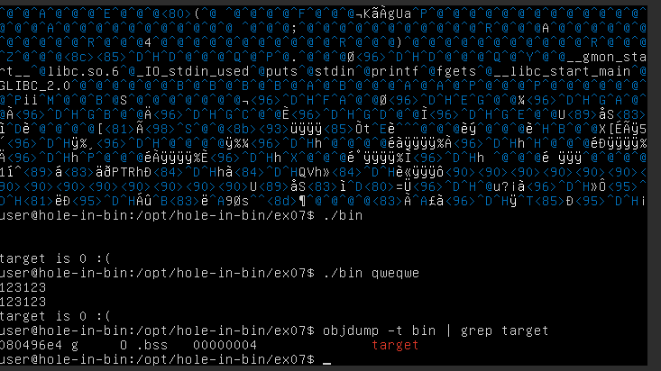

# hole-in-bin
### Objective

This exercise is designed to test skills and understanding of binary exploitation and reverse engineering. I needed to through a series of binary exploitation challenges using a provided virtual machine.


### Setup

1. Download your preffered virtual machine software (e.g. VirtualBox, VMware, etc.)

2. Download [hole-in-bin.ova](https://assets.01-edu.org/cybersecurity/hole-in-bin/hole-in-bin.ova) image and iport it to your VM software.
3. Start the VM and login with the following credentials:
   - Username: `user`
   - Password: `user`

4. For the love of god find out your ip address, add the port under advanced network settings and ssh into the vm. This will make your life alot easier. I figured it out waaaaaaaaay to late and suffered using the vm terminal.

### The Challenges


Inside the /opt/hole-in-bin directory, you will find a set of binaries (ex00 to ex11) that you need to exploit. Each binary presents a unique challenge and will test different aspects of your knowledge about binary exploitation and reverse engineering. You can find more details in a README.txt file inside each exercise folder.

Your task is to exploit these binaries, following ethical hacking guidelines.

# Exercises

Terminal has no interactions with the mouse. To navigate through the terminal you have to use the keyboard shortcuts ```shift+PgUp```/```shift+PgDn``` or use ```less``` or ```more``` commands.
Im sure there is a more elegant way to navigate, but this is what I used. 

 After trying different things in the vm terminal I stumbled uppon a hint for a file located at /protostar/stack0/stack0.c. After googleing I found source code for all the exersices presented [here.](https://exploit.education/protostar/stack-zero/) 

Hint for protostar:

 

## EX00

After entering the ex00 directory, you will find a binary file named **bin** and a README.md containing the instructions.


**Solution:**

Give the program an argument that is longer than 64 characters.


## EX01
Instructions:


We can determen that the program wants a specific arguments.


We need to disassemble the binary to find the correct argument.

In the ec01 directory:

```objdump -d bin```

Locate the compare argument ```cmp``` in main.


Use [ascii table](https://www.asciitable.com/) to convert the hex values.

Add it to the end of theoverflow string.


## EX02

Instructions:


Used instructions provided in ex01 to find the correct argument.

**Solution:**


## EX03

Instructions:

*This level is completed when you see the "code flow succesfully changed" message.*

**Solution:**

If statement has a wrong pointer and doesn't go to **win** function.

Correct pointer is before the win function.


Correct it by inserting the correct pointer to the end of buffer.


* x - stands for hex
* Address is backwards because of it's an 32-bit architecture.

## EX04

Instructions:

*This level is completed when you see the "code flow succesfully changed" message.*

**Solution:**

*Used instructions provided in ex03 to find the correct argument.*


## EX05

Instructions:

*This level is completed when you hit the correct target correctly.*

**Solution:**

Used ```objdump -d bin``` to disassemble the binary.


Target is likely **0xdeadbeef**.


## EX06

Instructions:

*This level is completed when you see the "that wasn't toobad now, was it?" message.*

**Solution:**

This one is a bit tricky. I used this [walk-trough](https://airman604.medium.com/protostar-heap-3-walkthrough-56d9334bcd13) to solve it.

Used ```objdump -d bin``` to disassemble and find the target.

The target is **0x08048464**.

Used gdb to find the offset.


## EX07

Instructions:


**Solution:**

Try to find target.



Target pointer is **0x080496e4**.

After trial and error find the correct spacing.


## EX08

Instructions:

*This level is completed when you see the "you have modified the target" message.*

**Solution:**

Try to find target using similar [methods](https://www.youtube.com) as before.

Target is  **0x080496f4**.


## EX09

Instructions:

*This level is completed when you see the "code execution redirected" message.*

*Hint objdump -TR is your friend.*

**Solution:**

hello () address is **080484b4**

exitGOT - **0x8049724**


Spliting up exitGot because it's a littbit too large of an number. 

exitGOT - **0x08049724**

exitGOT2 - **0x08049726**

Used python script to generate the payload.


*I took command from history because there were too many spaces to get an actual screenshot of command and result in one photo.*

## EX10

Instructions:

*This level is completed when you see the “level passed” message.*

**Solution:**

We have to add 72 char for the buffer and then add the target address. 

We need to find winner function address with good old ```objdump -d bin | grep winner``` and use it as a target.


We can determine that the target is **08048464**.

Now we will print 72 characters and then the target address in reverse order.


## EX11

Instructions:

*This level is completed when you see the “and we have a winner” message.*

**Solution:**

We need to allocate 8 bytes for the name, 8 bytes for the header data, 4 bytes for the integer then add the target address and supply our second argument.


Let's find out the target and winner addresses.


The target is **8049774** and winner is **8080484**.

Let's print 20 characters, then the target addresses in reverse order.


## Assingment description

For a detailed description of the assignment and audit questions, please click [here.](https://github.com/01-edu/public/tree/master/subjects/cybersecurity/hole-in-bin)