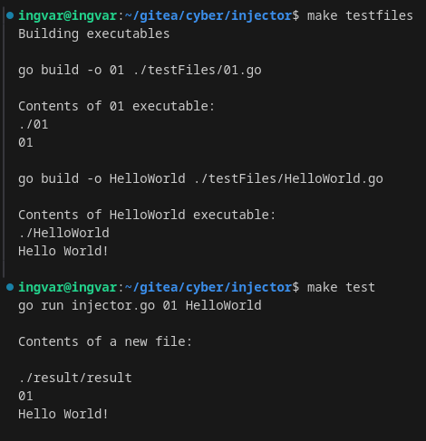

# Injector

### Objective

The objective of this assignment is to develop a program that merges one target program with another.

## Usage

A Makefile has been provided to test the program.

You can run the following Make commands to test the program:

- To compile the test files: ```make testfiles```
- To test: ```make test```

Example:



*Note: If, for any reason, you want to run the program manually, please use the arguments shown in the example above.*

Task description and audit information can found [here.](https://github.com/01-edu/public/tree/master/subjects/cybersecurity/injector) 