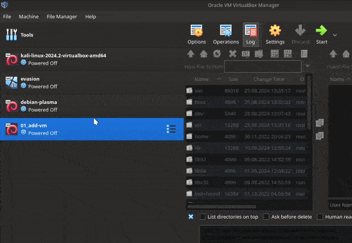

# [add-vm](https://github.com/01-edu/public/tree/master/subjects/add-vm/audit)

## Objecive

The objective of this project is to download premade virtual machine, add it to virtualbox, run the virtual machine and take a snapshot of the virtual machine.

## Demonstration

You can see the demonstration of the audit questions down below:

*Note: I've ommited the download and adding part of the virtual machine as it is not relevant to the audit questions.*

## Task Description
You can find the task description [here.](https://github.com/01-edu/public/tree/master/subjects/add-vm)