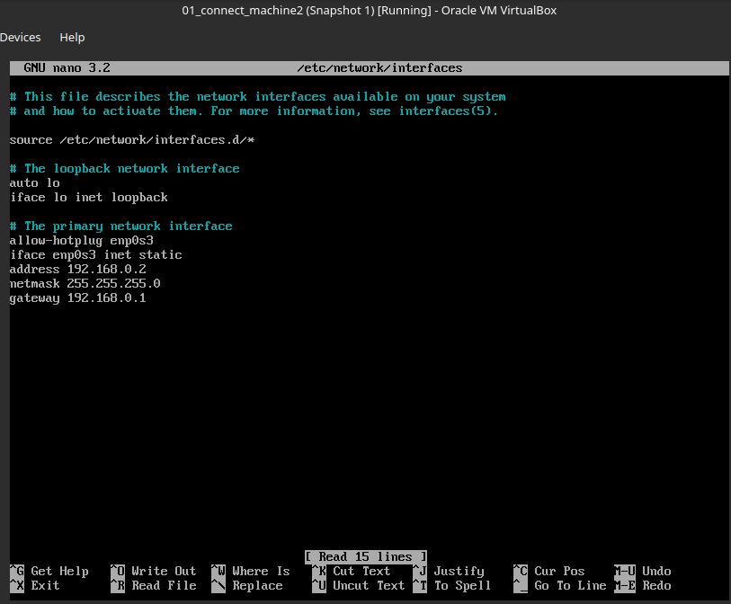
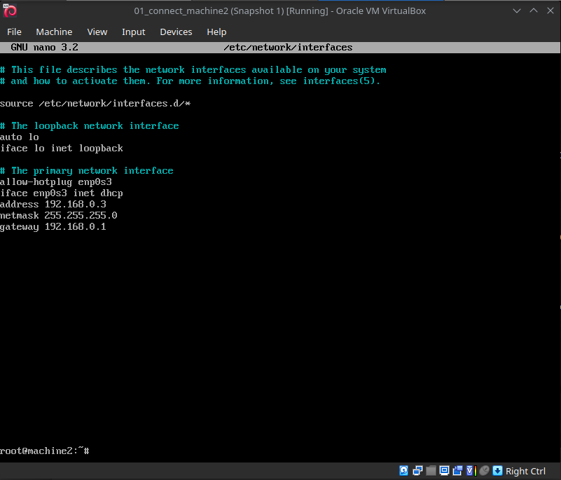
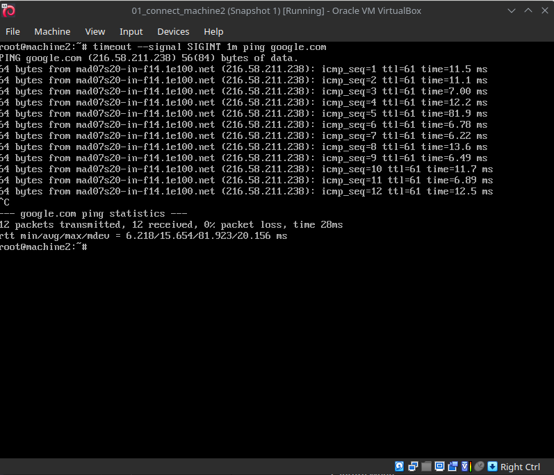

# [connect](https://github.com/01-edu/public/tree/master/subjects/connect/audit)

## Objective

- Identify and resolve the IP address conflict by changing machine2's IP address.
- Reconfigure machine2 to use dynamic IP addressing via the DHCP server on 01_connect_box.
- Verify improved connectivity and reduced packet loss after making the necessary changes.

## Solution

Start all 3 machines.

Looking at the [network illustration](https://github.com/01-edu/public/tree/master/subjects/connect), we detect that machine2 is configured with the same IP address as machine1. This is the cause of the IP address conflict.

1. Log into machine2:
   
   - **username:** `root`
   - **password:** ` ` (single space)

2. In the terminal, open the network configuration file with a text editor:
 
      ```bash
      nano /etc/network/interfaces
      ```

  - Change the address to a unique IP address. For example, change the address from `192.168.0.2` to `192.168.0.3`.

  - Change the connection from static to dhcp.

  Before:

  
  
  After:

  

3. Save the changes(`Ctrl+O`), confirm with `Enter` and exit the editor(`Ctrl+X`).

4. Restart the network service to apply the changes:
      ```bash
      systemctl restart networking
      ```

5. Verify the network configuration changes:
      ```bash
      ip addr show
      ```

6. Ping google.com:
      ```bash
      timeout --signal SIGINT 1m ping google.com
      ```

   