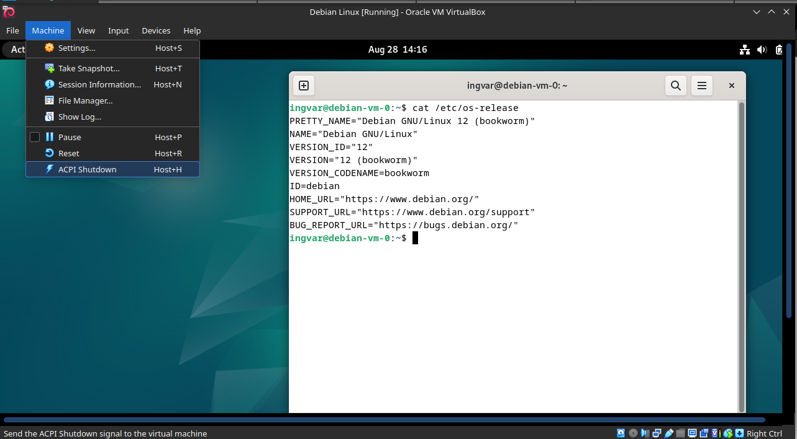

# [linux](https://github.com/01-edu/public/tree/master/subjects/linux)
This is the first assignment of AdminSys branch and is designed to introduce you to the Linux operating system, specifically a distribution called Debian, and its application in server environments. You will learn the easiest way of installing linux on the virutal machine using VirtualBox and gracefully shutting down the virtual machine.

### Installation Guide
**Step-by-Step Instructions**
1. **Install VirtualBox:**
- Download and install [VirtualBox](https://www.virtualbox.org/) on your computer. This will provide the environment to create and manage virtual machines.
2. **Download the Debian Disk Image (ISO):**
- Obtain the [Debian ISO](https://www.debian.org/) from the official Debian website.
3. **Create a Virtual Machine in VirtualBox:**
- Open VirtualBox and create a new VM.
- Attach the ISO File
- Configure the VM settings according to the requirements (memory, disk size, etc.).
4. **Install Debian:**
- Follow the on-screen instructions in the Debian installer. Once installation is complete, the VM will reboot into a ready-to-use Debian system.
5. **Shut Down the Virtual Machine:**
- After installation, gracefully shut down the VM using the "ACPI Shutdown" option under Machine drop down menu loacted in the top left corner, which simulates pressing the power button on a physical computer.

## Task Description
- Task description and audit questions are available [here.](https://github.com/01-edu/public/tree/master/subjects/linux/audit)