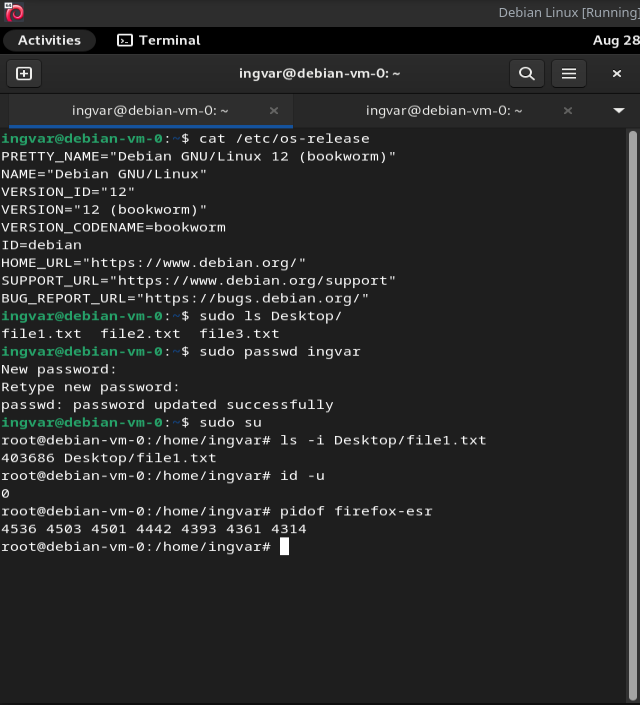

# [login](https://github.com/01-edu/public/tree/master/subjects/login/audit)

In this assingment I will go through some of the most common linux commands asked to be used in the audit questions.

## Demonstration

You can see the usage of commands asked in the audit questions below:


## Questions


**Is virtualization software correctly installed on the auditee's machine?**

To check the software on this VM I used to command "cat /etc/os-release" to check the OS version. Also its shown on tool bar that Debian Linux is running.

**Ask the auditee to login as a user in one terminal.**
- Has the password been correctly changed to "michelle"?

    To show that I have sudo access, I listed all files on Desktop using command ```sudom ls Desktop```

    To change the password I used the command ```sudo passwd ingvar``` and proceeded to change the password to "michelle".

**Ask the auditee to login as a superuser (root) in another terminal.**
- Has the password been correctly changed to "michelle"?

    In my case I used the command ```su``` to login as root. My user and root are the same so I didn't need to change the password.

**Ask the auditee to execute a command to show you the inode of a file. (The inode is a number)**
- Has the auditee correctly shown you (and if necessary explained) the inode of a file?

    To show the inode of a file I used the command ```ls -i Destop/file1.txt``` to show the inode of the file.

    **What is the inode of the file?**

    An inode (index node) is a data structure on a filesystem on Linux and other Unix-like operating systems that stores information about a file or directory. Each file or directory has an inode, which contains metadata about the file, but not its name or its actual data. Here’s what an inode typically includes:
        - **File Type:** Whether the file is a regular file, directory,symbolic link, etc.
        - **Permissions:** Read, write, and execute permissions for the owner,group, and others.
        - **Owner Information:** The user ID (UID) and group ID (GID) of thefile's owner.
        - **File Size:** The size of the file in bytes.
        - **Timestamps:** Three timestamps:
            - **ctime:** Change time, when the inode metadata was last changed.
            - **mtime:** Modification time, when the file content was lastmodified.
            - **atime:** Access time, when the file was last accessed.
            - **Link Count:** The number of hard links pointing to the inode.
            - **Pointers to Data Blocks:** Information about the locations of the file's actual data blocks on the disk.

    **How it works:**
    - When you create a file, the filesystem assigns it an inode number, which is unique within that filesystem. The inode number is how the system internally tracks the file.
        
    - The directory entry maps the file name to its inode number, so when you look up a file by name, the system retrieves the inode number and then uses that inode to find the actual data blocks on the disk.
    
    **Why is it important?**
    Inodes are crucial for managing files on a filesystem. They allow the system to efficiently manage files, handle multiple hard links to the same file, and maintain the integrity and security of the data. Understanding inodes is important for advanced file system operations, such as troubleshooting disk space issues or performing low-level file management tasks.

**Ask the auditee to execute a command to show you the current user ID (it is also a number).**
- Has the auditee correctly shown you (and if necessary explained) the id a the user?

A User ID (UID) is a unique numerical identifier assigned to each user on a Linux or Unix-like operating system. The UID is used by the system to identify and manage user accounts, control access to resources, and enforce permissions.

**Key Points about User IDs:**
1. Unique Identification:

- Each user on the system has a unique UID. This unique number allows the operating system to differentiate between users and manage permissions accordingly.

2. Default UIDs:

- The UID for the root user (the superuser) is always 0. This user has full administrative privileges and unrestricted access to all commands and files.
- Regular user accounts typically have UIDs starting from 1000 or 1001 (depending on the distribution) and increase incrementally as new users are added.
- System users or service accounts (like daemon, mail, www-data, etc.) often have UIDs below 1000. These are special-purpose accounts used for running specific services or daemons.

3. Associated with Usernames:

- While users are generally identified by their usernames (e.g., ingvar), the system primarily uses the UID to control access to resources. Each username is associated with a UID in the /etc/passwd file.

4. Permissions and Ownership:

- The UID plays a crucial role in determining the ownership of files and directories, as well as enforcing read, write, and execute permissions. The system checks the UID of a user against the file's metadata (specifically, the owner UID) to decide if access should be granted or denied.

**How to Find a User ID:**

You can find your current user ID by running the id -u command:```id -u```

This output shows that the current user's UID is 0 becasue Im signed in as root.

**Why are UIDs Important?**

- UIDs are critical for maintaining security and proper access control on a multi-user system. By relying on UIDs rather than usernames, the system ensures that permissions and ownership are handled consistently, regardless of any changes to a user's name or other personal information.
- Understanding UIDs is essential for system administration tasks like user management, file permissions, and access control.

**Ask the auditee to execute a command to show you the PID (another number) of a program (like bash for example).** 
- Has the auditee correctly shown you (and if necessary explained) the PID a program?

To see a pid of a program I used the command ```pidof firefox-esr``` to show the PIDs of firefox-esr running on the system.

A Process ID (PID) is a unique numerical identifier assigned to each running process on a Linux or Unix-like operating system. The PID is used by the system to track and manage processes, allowing it to identify and interact with them as needed.