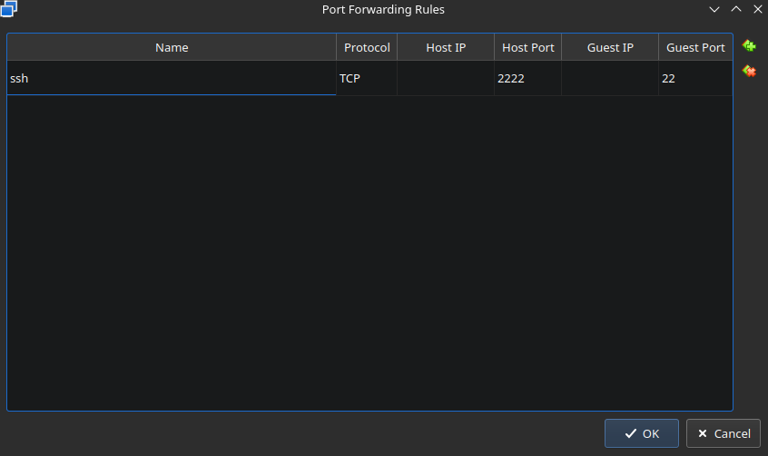
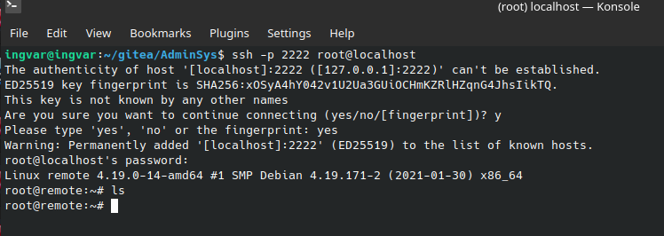

# [remote](https://github.com/01-edu/public/tree/master/subjects/remote/audit)

# Objective

- Configure a remote vm to accept SSH in virtualbox.
- Connect using SSH to the remote vm.

# Solution

1. Add remote vm to virtualbox.
2. Open remote settings -> Network
3. Make sure you are using a NAT network.
4. Open advanced -> Port forwarding
5. Add a new rule. 

6. Open a terminal and connect to the remote vm using ssh.

