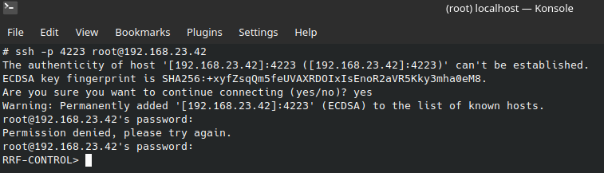

# [scan](https://github.com/01-edu/public/tree/master/subjects/scan/audit)

## Objective

- Scan network interface
- Find a way in the server "01_scan_RRF-CONTROL"

## Walktrough

- Download and add both VMs to your virtualbox
- Start both VMs
- Connect to "01_scan_laptop" over ssh with the provided credentials:
    - Username: `root`
    - Password: ` `(single space)
    
    ```bash
    ssh -p 10122 root@localhost
    ```

- Scan `enp0s8` network interface on local network

```bash
arp-scan -I enp0s8 --localnet
```

- Scan "01_scan_RRF-CONTROL" ip address for open ports:

```bash
nmap -p- -T4 192.168.23.42 
```

- Connect to "01_scan_RRF-CONTROL" over ssh through port 4223`:
    ```bash
    ssh -p 4223 root@192.168.23.42
    ```
    - Username: `root`
    - Password: `Z1ON0101`

