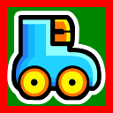
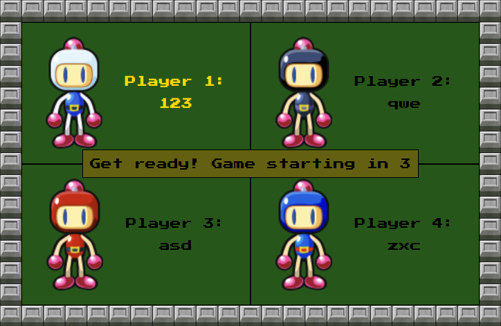
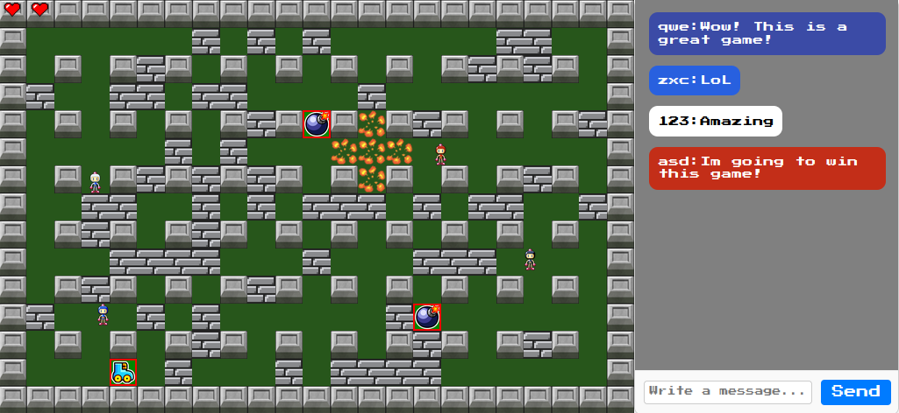
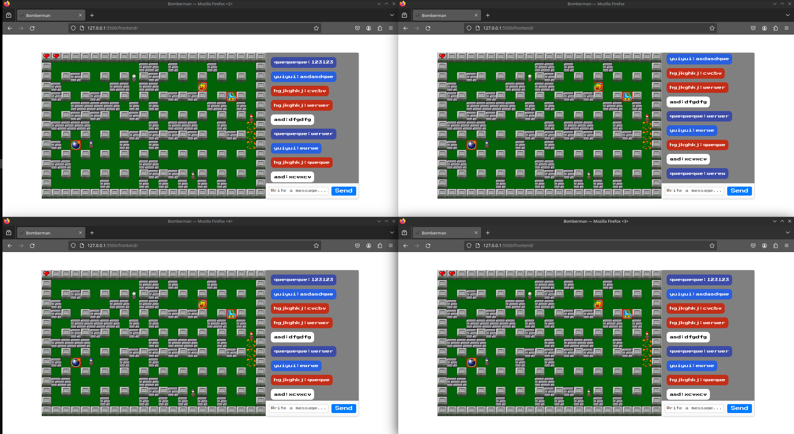

# [bomberman-dom](https://01.kood.tech/git/root/public/src/branch/master/subjects/bomberman-dom/README.md)

This is a minimalistic alpha version of the classic Bomberman game. The game is played in a 2D grid where the player can move around and place bombs. The goal is to destroy the blocks on the map to acquire powerups and defeat the other players by placing bombs next to them.

### Game rules

You can navigate the map using the arrow keys and place bombs using the spacebar. The bombs will explode after a few seconds and destroy any blocks or players in the vicinity. If a player is caught in the explosion, they will lose a life. The game is played until the last man is standing

There are 3 types of powerups in the game:

 - Extra bomb

 - Longer bomb range

 - Speed boost

### Screenshots

 

<br>



<br>



## Technologies used

- HTML
- CSS
- JavaScript
- Go
- Docker

The game is played in a browser and uses WebSockets to communicate with different users in realtime using a backend server written in Go.


## Usage

To run the game, you will need two terminal windows to run the backend and frontend servers.

- Navigate terminal to the ./backend folder and run the server with the command: 

    ``` go run .```

- Navigate the other terminal to the ./frontend folder and run the server with the commands: 

    ```npm install``` *(You can ignore the npm Warn messages.)*

    ```npm start``` 

- Open a browser to play the game.


#### This can also be achieved by utilizing the Makefile and running it in a Docker container. 

- ```make run``` - to build and run docker containers.
- ```make stop``` - to close and delete docker containers.


## [Audit Questions](https://01.kood.tech/git/root/public/src/branch/master/subjects/bomberman-dom/audit/README.md)

Try to open the game.

✅ Were you asked for a nickname?

Functional

 Try to open the game.

✅ Were you asked for a nickname?

✅ After entering your nickname, were you redirected to a waiting page presenting a player counter?

✅ After entering your nickname, did you have access to a chat?

Try to enter with another user (in another browser or in private browser).

✅ Did the player counter incremented by 1?

✅ After entering with another user, can all users chat with each other in realtime (using websockets)?

 Wait 20 seconds with two users in the waiting page.

✅ After 20 seconds, did you get 10 second game start countdown?

✅ After the 10 seconds did the game start?

Try to enter with 4 different users in the waiting page.

✅ As soon as the fourth player entered, did you get 10 second game start countdown?

✅ While playing the game, are you able to move and place bombs?

✅ Can players see the whole map at once? 

Try placing a bomb and standing by it when it explodes.

✅ Did you lose 1 of your 3 lives?

 Try to lose all your 3 lives.

✅ Did you lose the game and are not able to play anymore?

Try placing a bomb next to another player.

✅ Did the other player lose a life when the bomb exploded?

Place a bomb next to a destroyable block.

✅ Did the block disappear when the bomb exploded?

Try to destroy every block on the map.

✅ Did the power ups appear in place of some of the blocks?

✅ Can you confirm that there are at least 3 types of power ups?

##### Open the Dev Tool in the Performance tab.

✅ Does the game run without frame drops?

##### Open the Dev Tool in the Performance tab.

✅ Does the game run at or around 60fps?

##### Open the Dev Tool in the performance tab and select the option rendering with the paint ON.

✅ Is paint used as little as possible?

##### Open the Dev Tool in the performance tab and select the option rendering with the layer ON.

✅ Are layers used as little as possible?

✅ Are [layers being promoted](https://developers.google.com/web/fundamentals/performance/rendering/stick-to-compositor-only-properties-and-manage-layer-count) properly?

#### Bonus

✅  Are players' lives displayed?

✅  Is the winner shown after the game in any way?

✅  Is there a way to start another game after a game is over?

## Autors
[MargusT](https://01.kood.tech/git/MargusT)

[IngvarLeerimaa](https://01.kood.tech/git/IngvarLeerimaa)